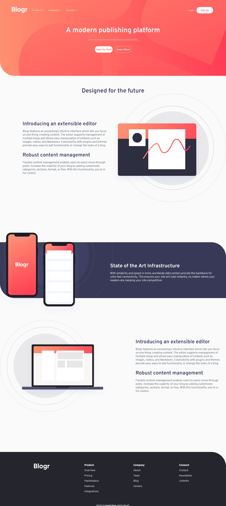

# Frontend Mentor - Blogr landing page solution

This is a solution to the [Blogr landing page challenge on Frontend Mentor](https://www.frontendmentor.io/challenges/blogr-landing-page-EX2RLAApP)

### Screenshot

### Links

- Live Site URL: [https://em-ee24.github.io/Blogr-Landing-Page/](https://em-ee24.github.io/Blogr-Landing-Page/)

### Built with

- Semantic HTML5 markup
- CSS custom properties
- Flexbox
- CSS Grid
- Mobile-first workflow