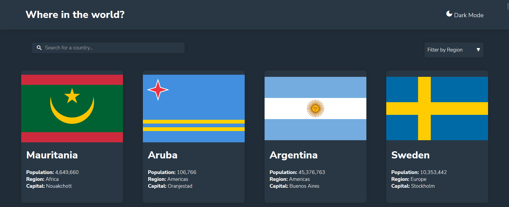

# Frontend Mentor - REST Countries API with color theme switcher

This is a solution to the [REST Countries API with color theme switcher challenge on Frontend Mentor](https://www.frontendmentor.io/challenges/rest-countries-api-with-color-theme-switcher-5cacc469fec04111f7b848ca)

### Screenshot

### Links

- Live Site URL: [https://moselsh.github.io/Countries_API_theme_mode_switcher/](https://moselsh.github.io/Countries_API_theme_mode_switcher/)

### Built with

- Semantic HTML5 markup
- CSS custom properties
- Flexbox