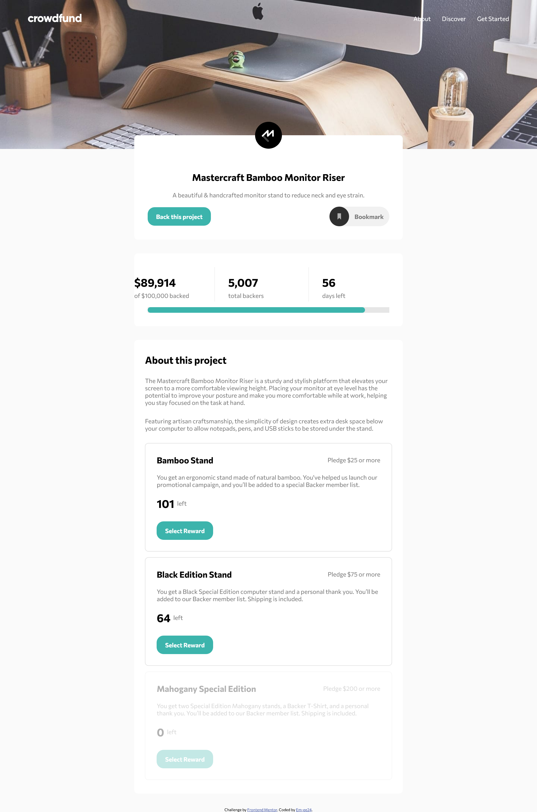

# Frontend Mentor - Crowdfunding product page solution

This is a solution to the [Crowdfunding product page challenge on Frontend Mentor](https://www.frontendmentor.io/challenges/crowdfunding-product-page-7uvcZe7ZR)

### Screenshot

### Links

- Live Site URL: [https://em-ee24.github.io/Crowdfunding-Project-Page/](https://em-ee24.github.io/Crowdfunding-Project-Page/)

### Built with

- Semantic HTML5 markup
- CSS custom properties
- Flexbox
- Mobile-first workflow
- Javascript (vanilla)