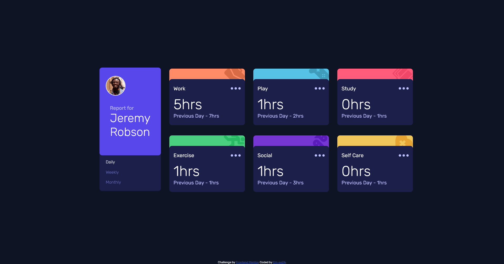

# Frontend Mentor - Time tracking dashboard solution

This is a solution to the [Time tracking dashboard challenge on Frontend Mentor](https://www.frontendmentor.io/challenges/time-tracking-dashboard-UIQ7167Jw)

### Screenshot

### Links

- Live Site URL: [https://MosElsh.github.io/Time-Tracking-Dashboard/](https://MosElsh.github.io/Time-Tracking-Dashboard/)

### Built with

- Semantic HTML5 markup
- CSS custom properties
- Flexbox
- CSS Grid
- Mobile-first workflow
- Javascript (vanilla)